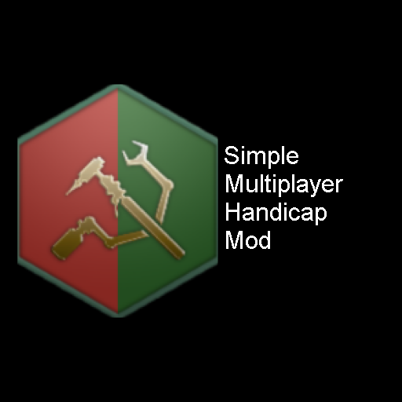

## Introduction
Welcome! This mod is simple and focuses on providing small handicaps to the strongest and weakest players in the game to allow for a diverse group of players to enjoy playing casually together.

### What does the mod do?
The mod provides players on game start with an event that allows them to decide what skill level they are at:

1. Weak
2. Regular
3. Strong

Choosing Weak will give the player a +7% boost to Energy, Minerals, Food, Unity, Research, Alloys, Consumer Goods, Population growth and Ship fire rate.

Choosing Regular will give the player nothing.

Choosing Strong will give the player a -6% penalty to Energy, Minerals, Food, Unity, Research, Alloys, Consumer Goods, Population growth and Ship fire rate.

The differences are such that the strong and weak players have a 13% gap between each other so that the weak players have a fighting chance against stronger players.

In addition to these, if a player picks weak or strong it will be broadcasted to the rest of the players so that everyone knows that someone picked their appropriate handicaps.

Lastly, players will be given a second chance to confirm if they picked Weak or Strong after about 3 months. Just to make sure they didn't misclick.

On top of these handicaps, every 5 years the game will give another -6% penalty to the strongest player once he is stronger than all the AI empires and a 7% bonus to the weakest player. This will help further adjust the handicaps in case someone misjudged how strong or weak they are.